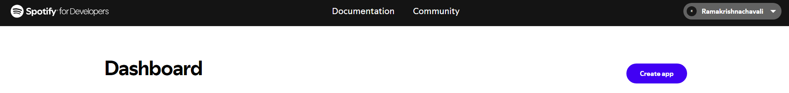
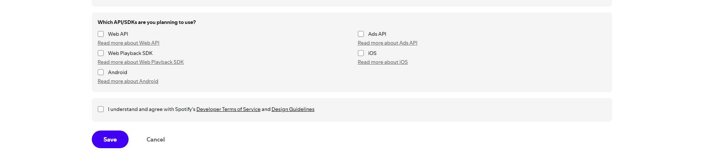
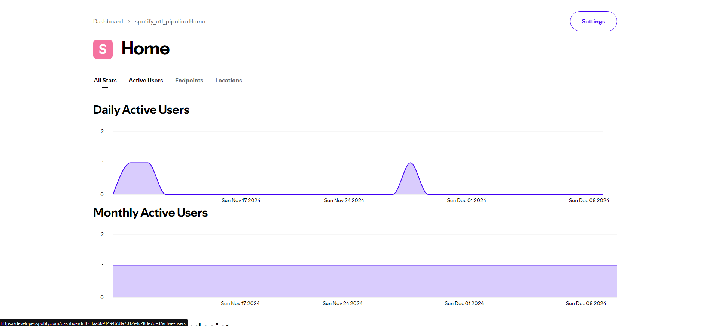
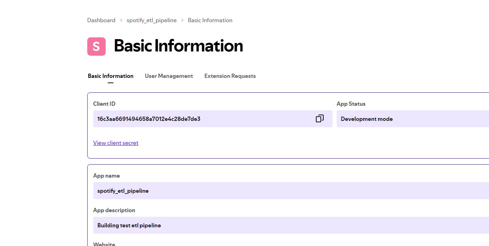

# Steps to access the spotify API keys.

* Go to [Spotify for Developers](https://developer.spotify.com/) website.

* Login to an account for which U have an existing spotify account. (u could create a new one to get the client and secret keys but if an account exists, it is better).

* Once dones, login and go to the dashboard and click on Create App.

* Enter all the details and click on Save.

* Now go to settings in the Dashboard and you will have your client and secret key there, which will help you to access the details of the playlist.

* Click on settings.

